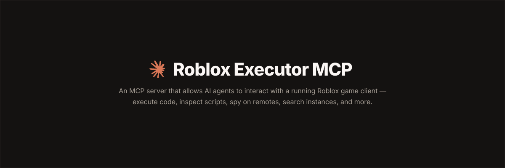

<p align="center">
  
</p>

# Roblox Executor MCP Server

An MCP server that allows Agents to interact with a running Roblox game client — execute code, inspect scripts, spy on remotes, and more.

## Dashboard

Roblox Executor MCP includes a local web dashboard at:

```text
http://localhost:16384/
```

Use it to see connected Roblox clients, inspect scripts, run tools, view server logs, configure semantic search, and index games for semantic script search.

## Features

- **Code Execution** — Run Lua code and fetch data from the game client.
- **Script Inspection** — Decompile scripts and search across all sources.
- **Instance Search** — CSS-like selectors and hierarchy trees.
- **Remote Spy** — Intercept, log, block, and ignore Remotes/Bindables via [Cobalt](https://github.com/notpoiu/cobalt). Basic remote inventory mode as fallback.
- **GUI Interaction** — Click buttons and type into text boxes.
- **Screenshot** — Capture screenshots on Windows (OS-level) or any platform (client-side viewport capture). The AI receives actual images it can visually analyze.
- **Multi-Client** — Connect multiple Roblox clients at once.
- **Primary / Secondary** — Multiple MCP instances auto-coordinate with automatic promotion. Supports remote relaying via `--baseurl`. See [Advanced](docs/advanced.md).
- **Game Understanding** — Player state snapshot, game GUI inspection, activity tracing, and game system discovery for writing automation scripts.
- **Anti-Cheat Tools** — Scan games for anti-cheat systems with detailed severity-level reports.
- **Anti-AFK** — Automatically prevents idle disconnections by responding to the `Player.Idled` event. Keeps you in the game.
- **Claude Remote Connector Support** — Works as a secure custom connector in Claude's web interface. See the [Claude Remote Connector Guide](docs/claude-connector.md).
- **Custom AI Chat** — Built-in chat interface at `/ai` supporting any Anthropic-compatible API with api-key, bearer token, or custom header auth. Screenshot images are passed to the AI as vision content.
- **Mobile Support** — Works with mobile executors (Delta, CodeX, VegaX, etc.) with fallbacks for missing APIs. See [Mobile README](MOBILE-README.md).

## Tutorial

[](https://youtube.com/watch?v=Tcy5RNf1TRc)

## Prerequisites

- **Node.js** ≥ 18
- **Bun** ≥ 1.3 for the interactive OpenTUI harness installer
- **A Roblox executor** that supports `loadstring`, `request`, and (preferably) `WebSocket`

## Quick Start

### 1. Clone the server

```bash
git clone https://github.com/voidhub9-dotcom/mcp-mobile.git
cd mcp-mobile
```

### 2. Run the harness installer

The installer builds the server, lets you choose AI clients, writes supported MCP configs, and prints the Roblox loader script.

```bash
npm run install:harnesses
```

The normal server build consumes the committed `connector.luau` artifact, so harness installs do not require Darklua. Connector developers can install the pinned tool with `rokit install`, edit `connector-src/`, and regenerate the artifact with `npm run build:connector`.

The picker is built with [OpenTUI](https://opentui.com/) and runs through Bun. `npm run install:harnesses` installs Bun first if it is not already available. It shows detected local clients by default; if none are detected, it warns you to install a harness first. Press `s` in the picker or pass `--show-all-harnesses` to reveal every supported config target. If your terminal has trouble with the interactive picker, use the plain numbered prompt:

```bash
npm run install:harnesses -- --plain
```

The installer can also place the Roblox loader into a detected executor autoexec folder, such as MacSploit on macOS or supported Windows executor autoexec folders. Use the prompt, or run:

```bash
npm run getscript -- --autoexec
```

It can also help with:

- cross-machine setup on the same LAN
- copying the Roblox loader to your clipboard
- optional Ollama `embeddinggemma` setup for semantic indexing
- pulling latest repo changes before install/build

To update an existing install later, run:

```bash
npm run update
```

The update command can stop currently running MCP server processes, optionally pull latest changes, and always rebuilds the server.

### Manual setup

If you prefer to configure a client yourself, use the setup guide for your client:

| Client         | Guide                                       |
| -------------- | ------------------------------------------- |
| Cursor         | [Setup Guide](docs/setup-cursor.md)         |
| Claude Desktop | [Setup Guide](docs/setup-claude-desktop.md) |
| **Claude (Web / Mobile / Remote)** | [**Remote Connector Guide**](docs/claude-connector.md) |
| Claude Code    | [Setup Guide](docs/setup-claude-code.md)    |
| Codex CLI      | [Setup Guide](docs/setup-codex.md)          |
| Windsurf       | [Setup Guide](docs/setup-windsurf.md)       |
| Antigravity    | [Setup Guide](docs/setup-antigravity.md)    |
| BLACKBOX AI    | [Setup Guide](docs/setup-blackbox.md)       |
| ZCode          | [Setup Guide](docs/setup-zcode.md)          |
| **Mobile**     | [**Mobile Setup Guide**](docs/setup-mobile.md) |

### 3. Connect from Roblox

The installer prints this for you. Put it in your executor or Auto Execute:

```lua
while not getgenv().MCP_Loaded do
    local bridgeUrl = getgenv().BridgeURL or "localhost:16384"
    pcall(function() loadstring(game:HttpGet("http://" .. bridgeUrl .. "/script.luau"))() end)

    task.wait(0.15)
end
```

**Optional settings** (set before the `loadstring`):

```lua
getgenv().BridgeURL = "10.0.0.4:16384"                  -- default: localhost:16384
getgenv().DisableWebSocket = true                        -- force HTTP polling
getgenv().DisableInitialScriptDecompMapping = true       -- skip initial decompilation
getgenv().MCP_FailedScriptResyncInterval = 30            -- retry failed script syncs periodically
getgenv().MCP_FailedScriptResyncBatchSize = 8            -- bound each periodic retry batch
getgenv().MCP_DisableAntiAFK = true                       -- disable anti-AFK (enabled by default)
```

After the MCP server starts and Roblox connects, open the dashboard:

```text
http://localhost:16384/
```

## Mobile Support

This MCP server works with **mobile Roblox executors** (Delta, CodeX, VegaX, etc.) on Android and iOS.

### Mobile-Only (No PC Needed) — Android

Run everything from your phone using Termux. See the [Mobile-Only Setup Guide](docs/setup-mobile-only.md).

```bash
# In Termux:
git clone https://github.com/voidhub9-dotcom/mcp-mobile.git
cd mcp-mobile
bash termux-setup.sh
bash termux-start.sh --cf
```

Then in your Roblox executor:
```lua
loadstring(game:HttpGet("http://localhost:16384/mobile-connector.luau"))("localhost:16384")
```

### Mobile-Only (No PC Needed) — iOS

Deploy the MCP server to a free cloud service (Railway/Render). Your iPhone connects to it over HTTPS. See the [iOS Cloud Setup Guide](docs/setup-ios-cloud.md).

```lua
-- In your Roblox executor:
getgenv().BridgeURL = "https://YOUR-APP.up.railway.app"
getgenv().MCP_AUTH_TOKEN = "your-token"
loadstring(game:HttpGet("https://YOUR-APP.up.railway.app/mobile-connector.luau"))()
```

### Mobile + PC Setup

If you have a PC, see the [Mobile Setup Guide](docs/setup-mobile.md) and [Mobile README](MOBILE-README.md).

```lua
loadstring(game:HttpGet("http://YOUR_PC_IP:16384/mobile-connector.luau"))("YOUR_PC_IP:16384")
```

## Claude (claude.ai) Custom Connector

This server works as a **custom connector** in Claude's web interface (claude.ai). Claude connects to your MCP server over HTTPS using the Streamable HTTP transport.

### Quick Setup

1. **Start the server in HTTP mode:**
```bash
node dist/index.js --http
```

2. **Expose it via HTTPS** (Claude requires HTTPS). Use a tunnel or cloud deployment:
```bash
# Option A: Cloudflare Tunnel (free, no signup needed for quick tunnels)
cloudflared tunnel --url http://localhost:16384

# Option B: Deploy to Railway/Render (provides HTTPS natively)
# See docs/setup-ios-cloud.md for cloud deployment guide
```

3. **Set an auth token** for security:
```bash
MCP_AUTH_TOKEN=your-secret-token node dist/index.js --http
```

4. **Add the connector in Claude:**
   - Go to **Settings > Connectors > Add custom connector**
   - **Name:** `Roblox MCP`
   - **URL:** `https://YOUR-TUNNEL-URL/mcp` (do **not** append `?token=`)
   - Leave OAuth fields blank unless you deliberately use a pre-registered client
   - Click **Add**, then **Connect**
   - On the Roblox MCP sign-in page, enter the `MCP_AUTH_TOKEN` configured on the server and choose **Authorize Roblox MCP**

   > Claude discovers OAuth metadata, registers a connector client, and receives a short-lived OAuth token. Do not store the long-lived server token in the connector URL.

5. **Connect your Roblox client** using the connector script:
```lua
loadstring(game:HttpGet("http://localhost:16384/mobile-connector.luau"))()
```

For deployment, OAuth authorization, end-to-end testing, and tool-permission guidance, see the [Claude Remote Connector Guide](docs/claude-connector.md).

## Custom AI Integration

This server includes a **built-in AI chat interface** — no separate AI client needed. It supports **any Anthropic-compatible API** with flexible auth modes (api-key, bearer token, or custom header), so you can use Claude, DeepSeek, or any compatible provider. Screenshots taken in-game are passed to the AI as vision content — the AI can actually see the game screen.

### Setup

1. Open the chat page in your browser:
```
http://localhost:16384/ai          # local
https://YOUR-APP.up.railway.app/ai  # cloud
```
2. Tap **Settings** and configure:
   - **API Key** — your API key or bearer token
   - **Auth Type** — `api-key` (x-api-key header), `bearer` (Authorization: Bearer), or custom header
   - **Base URL** — the Anthropic-compatible endpoint (e.g. `https://api.anthropic.com`)
   - **API Version** — e.g. `2023-06-01`
   - **Default Model** — e.g. `claude-sonnet-4-20250514`
   - **Extended Thinking** — toggle to show the AI's reasoning process
3. Start chatting — the AI can use all MCP tools (execute code, inspect scripts, search, GUI interaction, take screenshots and see them, etc.)

### Environment Variables (optional, for cloud deployment)

| Env Var | Default | Description |
|---------|---------|-------------|
| `CUSTOM_AI_API_KEY` | — | API key |
| `CUSTOM_AI_BASE_URL` | `https://api.anthropic.com` | Anthropic-compatible base URL |
| `CUSTOM_AI_API_VERSION` | `2023-06-01` | API version header |
| `CUSTOM_AI_MODEL` | `claude-sonnet-4-20250514` | Default model |
| `CUSTOM_AI_MAX_TOKENS` | `16000` | Max response tokens |
| `CUSTOM_AI_THINKING_ENABLED` | `false` | Enable extended thinking |
| `CUSTOM_AI_THINKING_BUDGET` | `10000` | Thinking token budget |
| `CUSTOM_AI_AUTH_TYPE` | `api-key` | Auth mode: `api-key` (x-api-key header) or `bearer` (Authorization: Bearer) |
| `CUSTOM_AI_BEARER_TOKEN` | — | Bearer token for OAuth/proxy auth |
| `CUSTOM_AI_AUTH_HEADER` | — | Custom auth header name override |

## Community

Have a suggestion or need help? Join the [Discord server](https://discord.gg/FJcJMuze7S).

## Security

> **This server allows arbitrary code execution.** Only use with AI clients you trust. For any publicly reachable deployment, set a strong `MCP_AUTH_TOKEN`; each cloned deployment automatically derives its own OAuth origin and Claude receives short-lived OAuth tokens. Never expose an unauthenticated deployment to the internet. See [Advanced](docs/advanced.md) for details.

## License

[MIT](LICENSE)
